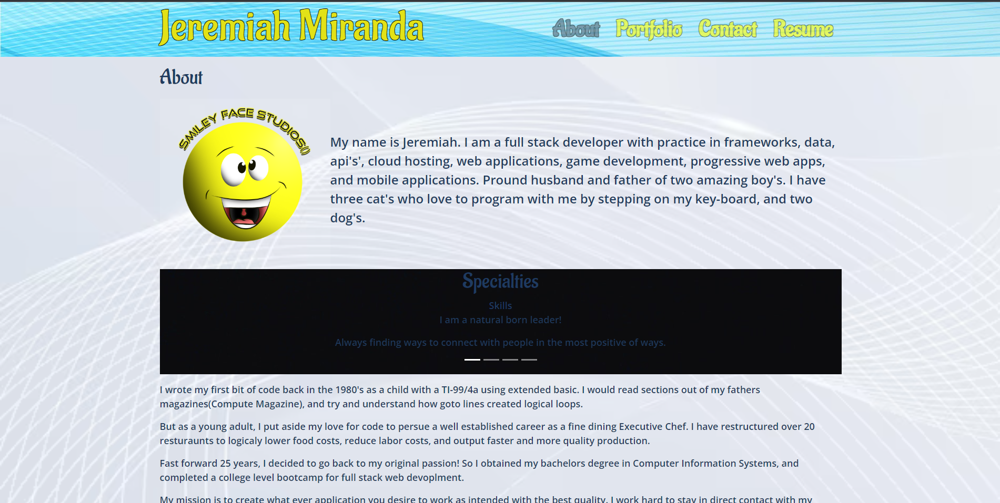
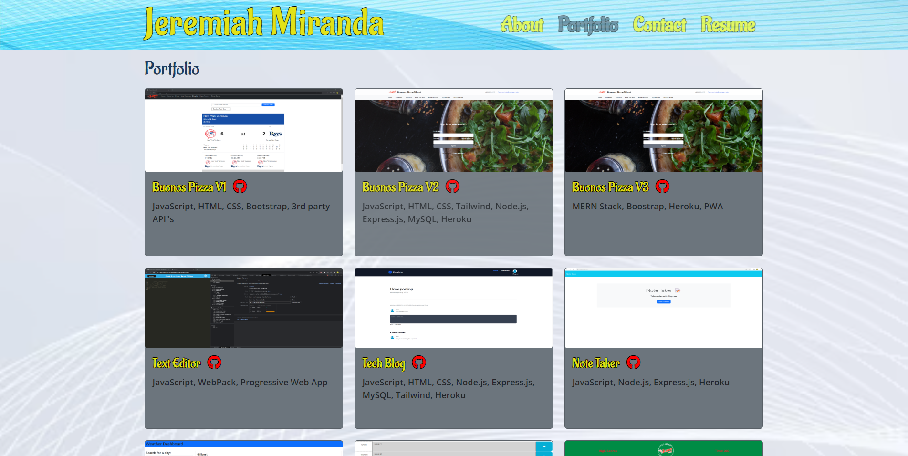
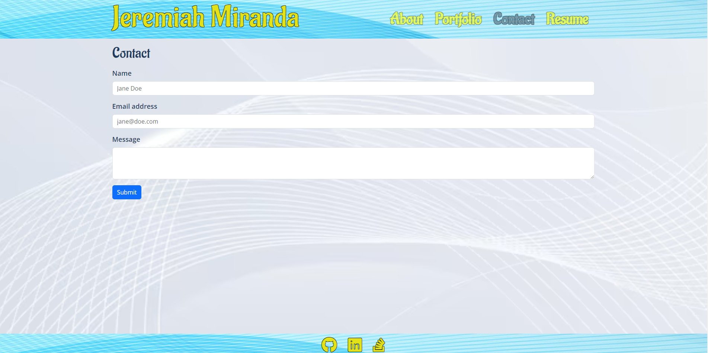
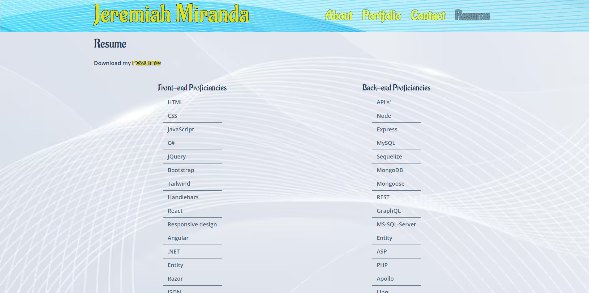

# react-portfolio
    
  ## License
   
 
  (https://www.gnu.org/licenses/gpl-3.0)

  ## Description
  The react portfolio is a place to demonstrate my variety of skills as a full stack web developer.  It will show case my projects and the technologies used to create them.  It will also provide a list of front end and back end skills, along with a link to view and download my resume.  It will also have an about me page to describe myself.  Lastly there is link to my github repository and my linkedIn account.    

  ## Table of Contents
  - [License](#license)
  - [Installation](#installation)
  - [Usage](#usage)
  - [Contribution](#contribution)
  - [Test](#test)
  - [Badges](#badges)
  - [Features](#features)

  ## Installation
  Clone: https://github.com/jeremiahmiranda79/react-portfolio

  ## Usage
  Webpage: https://jeremiahmiranda79.github.io/react-portfolio/

  ## Contribution
  I used my README.md file generator to create this README.md 😉

  GitHub: https://github.com/jeremiahmiranda79/Pro-README-FILE-Generator

  Email: jeremiahmiranda79@gmail.com

  ## Test
  N/A

  ## Badges
       

  ## Features
  TODO: Manually add you features here(for now 😉)!

   - About page
  

  - Portfolio page
  

  - Contact page
  

  - Resume page
  